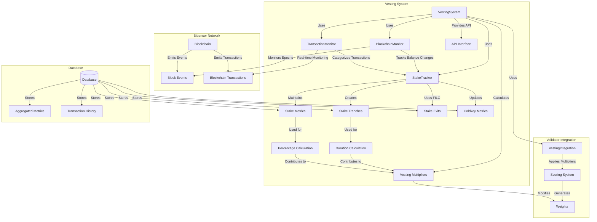

# Bettensor Vesting System

The Bettensor Vesting System is designed to incentivize miners to hold their earned rewards rather than immediately selling them. This promotes long-term commitment and alignment with the network's interests.

## Architecture Overview

The vesting system follows a modular architecture with specialized components that work together to track, analyze, and apply multipliers based on stake retention patterns.



## Overview

The vesting system tracks stake changes on the blockchain and applies multipliers to miners' scores based on:

1. **Amount Held**: The percentage of rewards a miner has retained vs. sold
2. **Duration Held**: How long the miner has maintained their stake

Miners who maintain a higher stake for longer periods receive higher multipliers, leading to increased rewards.

## Enhanced Tranche-Based Accounting with FILO

The vesting system uses a sophisticated tranche-based accounting system with FILO (First-In-Last-Out) to accurately track stake holding duration:

### What are Tranches?

In financial terms, a "tranche" is a portion of something, especially money. In our system, each stake addition (whether manual or from emissions/rewards) creates a new "tranche" with:
- The amount added
- A timestamp of when it was added
- Whether it's from emissions or manual stake

### FILO Accounting for Stake Withdrawals

When stake is withdrawn, we use First-In-Last-Out (FILO) accounting:
1. Newest tranches are consumed first
2. Oldest tranches are preserved as long as possible
3. Partial tranche consumption is tracked precisely
4. Each withdrawal creates "exit" records for affected tranches

This approach allows miners to:
- Build up long-term holdings while still having operational liquidity
- Withdraw newer rewards without resetting their holding duration
- Gradually increase their average holding duration over time
- Achieve meaningful multipliers even with periodic withdrawals

## System Components in Detail

### 1. BlockchainMonitor

This component is responsible for tracking stake changes on the blockchain, with a focus on periodic balance monitoring and epoch boundary detection.

**Key Functions:**
- `initialize()`: Sets up the monitor, loads last processed blocks, and initializes epoch tracking
- `track_balance_changes(epoch)`: Tracks balance changes for a specific epoch
- `track_manual_transactions()`: Tracks manual stake transactions
- `_check_for_epoch_boundary(block_num)`: Detects when a new epoch begins
- `start_background_thread(thread_nice_value)`: Starts a background thread for continuous monitoring

**Implementation Details:**
- **Epoch Detection**: Uses the `blocks_since_step` parameter from the network's dynamic info to detect epoch boundaries
- **Blockchain Connection**: Connects to the Substrate blockchain via the Subtensor client
- **Block Processing**: Processes blocks to extract stake-related events
- **Thread Priority**: Configurable thread priority for background processing
- **DB Integration**: Uses the DatabaseManager for storing processed data

**Thread Safety Considerations:**
- Uses a unique WebSocket connection name to avoid conflicts with other components: `blockchain_monitor_{subnet_id}_{timestamp}`
- Thread-safe state management with proper locking mechanisms
- Graceful shutdown handling through stop events

### 2. TransactionMonitor

Provides detailed, real-time transaction monitoring via blockchain subscription. It receives immediate notifications for new blocks and processes them for stake-related activities.

**Key Functions:**
- `start_monitoring(thread_nice_value)`: Starts real-time blockchain monitoring via WebSocket subscription
- `_monitoring_thread_loop()`: Main thread function that sets up subscription and processes blocks
- `_block_header_handler(block_header, update_nr, subscription_id)`: Handler for new block notifications
- `_process_block(block_num, block_hash)`: Processes a block for transactions and events
- `_process_extrinsics(block_num, extrinsics)`: Processes extrinsics for stake-related calls
- `_process_events(block_num, events_decoded)`: Processes events for stake-related events

**Transaction Categories:**
- `INFLOW`: Stake added to hotkey (AddStake, destination of MoveStake/SwapStake)
- `OUTFLOW`: Stake removed from hotkey (RemoveStake, origin of MoveStake/TransferStake)
- `NEUTRAL`: No net change (certain TransferStake scenarios)
- `EMISSION`: Stake added via network emissions/rewards

**Transaction Types:**
- `ADD_STAKE`: Manually adding stake to a hotkey
- `REMOVE_STAKE`: Manually removing stake from a hotkey
- `TRANSFER_OWNERSHIP`: Transferring ownership of a hotkey
- `BURN_STAKE`: Burning stake (removing it from circulation)
- `MOVE_STAKE`: Moving stake between hotkeys
- `SWAP_STAKE`: Swapping stake between hotkeys
- `EMISSION_REWARD`: Stake added via emissions/rewards

**Real-time Processing:**
- Uses WebSocket subscription for immediate block notification
- Dedicated thread for continuous monitoring
- Unique connection naming: `tx_monitor_{subnet_id}_{timestamp}`
- Robust error handling and reconnection logic

### 3. StakeTracker

The central accounting system that maintains stake metrics and implements the tranche-based FILO accounting mechanism.

**Key Functions:**
- `update_stake_metrics(hotkey, updates)`: Updates stake metrics for a hotkey
- `create_stake_tranche(hotkey, coldkey, amount, source)`: Creates a new stake tranche
- `record_stake_exit(hotkey, amount)`: Records a stake withdrawal using FILO accounting
- `calculate_holding_metrics(hotkey)`: Calculates stake holding metrics
- `calculate_vesting_multiplier(hotkey, min_stake, target_pct, window_days, max_mult)`: Calculates the vesting multiplier
- `get_tranche_details(hotkey, include_exits)`: Gets detailed tranche information
- `update_coldkey_hotkey_relationships()`: Updates the many-to-one coldkey-hotkey relationships

**Tranche Management:**
- Each stake addition creates a new tranche with amount, timestamp, and source
- Withdrawals process newest tranches first (FILO)
- Partial tranche consumption tracked with exit records
- Exit records include exit amount, timestamp, and reference to original tranche

**Stake Metrics Tracking:**
- Total stake by hotkey
- Manual vs. earned (emission) stake distinction
- Retained vs. withdrawn stake tracking
- Average holding duration calculation
- Percentage of stake retained calculation

**Coldkey Relationship Management:**
- Many-to-one hotkey to coldkey mapping
- Aggregated metrics by coldkey
- Proper handling of transferred hotkeys

### 4. VestingSystem

The main orchestration component that integrates all other components and provides the primary interface for the validator.

**Key Functions:**
- `initialize(auto_init_metagraph, **kwargs)`: Initializes the system and optionally sets up from metagraph
- `initialize_from_metagraph(metagraph, force_refresh)`: Initializes stake data from the network metagraph
- `calculate_vesting_multiplier(hotkey, stake_amount)`: Calculates a vesting multiplier for a hotkey
- `apply_vesting_multipliers(weights, uid_to_hotkey)`: Applies vesting multipliers to weights
- `get_diagnostic_info()`: Gets diagnostic information about the vesting system
- `update_coldkey_hotkey_relationships()`: Updates coldkey-hotkey relationships
- `start_background_thread(thread_priority)`: Starts background monitoring threads
- `shutdown()`: Gracefully shuts down all components

**Multiplier Calculation:**
- Percentage factor based on stake retention: `min(1.0, holding_percentage / retention_target)`
- Duration factor based on holding duration: `min(1.0, avg_holding_duration / retention_window_days)`
- Combined factor using geometric mean: `(percentage_factor * duration_factor) ** 0.5`
- Final multiplier: `1.0 + combined_factor * (max_multiplier - 1.0)`

**Metagraph Integration:**
- Automatic detection of metagraph changes
- Initialization of stake data from metagraph
- Handling of miner deregistrations
- Handling of new miner registrations

**Background Thread Management:**
- Configurable thread priorities
- Proper startup and shutdown handling
- Independent threads for blockchain and transaction monitoring

### 5. VestingIntegration

Provides integration with the validator's scoring system to apply vesting multipliers to weights.

**Key Functions:**
- `install()`: Installs the integration by patching the scoring system's calculate_weights method
- `uninstall()`: Uninstalls the integration, restoring the original method
- `_modified_calculate_weights(*args, **kwargs)`: Modified version of the calculate_weights method that applies vesting multipliers

**Patching Mechanism:**
- Uses function wrapping to modify the scoring system's behavior
- Preserves original function for later restoration
- Applies multipliers while preserving relative weight relationships

### 6. API Interface

Provides methods to expose vesting data to external services for analytics, dashboards, and monitoring.

**Key Functions:**
- `push_system_overview()`: Pushes system configuration and overall stats
- `push_all_stake_metrics()`: Pushes stake metrics for all miners
- `push_all_coldkey_metrics()`: Pushes coldkey metrics for all coldkeys
- `push_recent_transactions()`: Pushes recent transaction data
- `push_tranche_data()`: Pushes tranche-level data
- `push_vesting_multipliers()`: Pushes calculated multipliers for all miners

**Features:**
- Individual data type pushing
- Comprehensive data updates
- Background polling
- Authentication
- Error handling and retry logic
- Configurable endpoints

## Database Schema

The system uses a sophisticated database schema to track all stake-related information.

**Main Tables:**
- `stake_metrics`: Current stake metrics by hotkey
- `stake_tranches`: Individual stake addition tranches with timestamps
- `stake_tranche_exits`: Records of tranche withdrawals using FILO accounting
- `stake_change_history`: History of all stake changes
- `stake_transactions`: Detailed transaction records
- `coldkey_metrics`: Aggregated metrics by coldkey
- `aggregated_tranche_metrics`: Pre-calculated tranche metrics for performance

**Schema Management:**
- Centralized schema definitions in `database_schema.py`
- Creation handled by DatabaseManager
- Proper foreign key constraints and indexes
- Version tracking and migration support

## Blockchain Integration

### Mainnet Connection

The system uses a direct connection to the Bittensor mainnet (Finney network) for transaction monitoring:e

```python
# Primary endpoint for transaction monitoring
substrate_url = "wss://entrypoint-finney.opentensor.ai:443"

# Unique connection naming to avoid conflicts
connection_name = f'tx_monitor_{subnet_id}_{int(time.time())}'
substrate = SubstrateInterface(
    url=substrate_url,
    ws_options={'name': connection_name}
)
```

### Real-time Block Processing

The transaction monitor subscribes to block headers to receive immediate notifications for new blocks:

```python
# Subscribe to block headers
subscription = substrate.subscribe_block_headers(block_header_handler)

# Process each block as it arrives
def block_header_handler(block_header, update_nr, subscription_id):
    block_num = int(block_header["header"]["number"], 16)
    block_hash = substrate.get_block_hash(block_num)
    process_block(block_num, block_hash)
```

Each block is examined for:
- Extrinsics (transaction requests)
- Events (confirmed transactions)
- Stake-related operations (add_stake, remove_stake, etc.)
- Emission reward distributions

## Example Usage

```python
import asyncio
import bittensor as bt
from bettensor.validator.database.database_manager import DatabaseManager
from bettensor.validator.vesting import VestingSystem, VestingIntegration
from bettensor.validator.scoring.scoring import ScoringSystem

async def main():
    # Initialize components
    subtensor = bt.subtensor(network="finney")
    db_manager = DatabaseManager("./validator.db")
    await db_manager.initialize()
    
    # Ensure vesting database exists
    vesting_db_manager = await db_manager.get_or_create_database_manager("vesting.db")
    
    # Create vesting system
    vesting_system = VestingSystem(
        subtensor=subtensor,
        subnet_id=19,
        db_manager=vesting_db_manager,
        minimum_stake=0.3,
        retention_window_days=30,
        retention_target=0.9,
        max_multiplier=1.5,
        use_background_thread=True,
        detailed_transaction_tracking=True,
        thread_priority="low"
    )
    
    # Initialize vesting system
    await vesting_system.initialize(auto_init_metagraph=True)
    
    # Integrate with scoring system
    scoring_system = ScoringSystem(db_manager=db_manager)
    await scoring_system.initialize()
    
    integration = VestingIntegration(
        scoring_system=scoring_system,
        vesting_system=vesting_system
    )
    integration.install()
    
    # Get diagnostic info
    diagnostic_info = await vesting_system.get_diagnostic_info()
    print(f"Vesting system status: {'OPERATIONAL' if diagnostic_info['is_operational'] else 'NOT OPERATIONAL'}")
    print(f"Records in stake_metrics: {diagnostic_info['tables'].get('stake_metrics', 0)}")
    print(f"Records in stake_tranches: {diagnostic_info['tables'].get('stake_tranches', 0)}")
    print(f"Records in coldkey_metrics: {diagnostic_info['tables'].get('coldkey_metrics', 0)}")
    
    # Run for a while
    try:
        while True:
            await asyncio.sleep(60)
            # Periodic operations...
    except KeyboardInterrupt:
        print("Shutting down...")
    finally:
        # Clean shutdown
        integration.uninstall()
        await vesting_system.shutdown()
        await db_manager.close()

if __name__ == "__main__":
    asyncio.run(main())
```

## Troubleshooting

Common issues and solutions:

### No Multipliers Applied

**Symptoms:**
- No vesting multipliers being applied
- Weights unaffected by stake retention

**Solutions:**
- Ensure VestingIntegration is properly installed
- Check that metagraph initialization was successful
- Verify minimum stake requirement is appropriate
- Check for errors in multiplier calculation logs

### Missing Transaction Data

**Symptoms:**
- Empty transaction history
- No stake changes recorded
- Missing stake_transactions records

**Solutions:**
- Ensure detailed_transaction_tracking=True
- Check transaction monitor is running (vesting_system.transaction_monitor.is_running)
- Verify blockchain connection is successful
- Check logs for WebSocket connection errors

### Database Errors

**Symptoms:**
- SQL errors in logs
- Missing tables or columns
- "Table not found" errors

**Solutions:**
- Run database_schema validation
- Ensure proper table creation through DatabaseManager
- Check database file permissions
- Verify SQLite version compatibility

### Blockchain Connection Issues

**Symptoms:**
- "Substrate interface not initialized" errors
- Missing block data
- Timeout errors during WebSocket operations

**Solutions:**
- Check network connectivity to blockchain endpoints
- Try alternative endpoint URLs
- Ensure correct network parameter ("finney" for mainnet)
- Check for firewall rules blocking WebSocket connections

---

For more information and examples, see the `/examples` directory or contact the Bettensor team. 